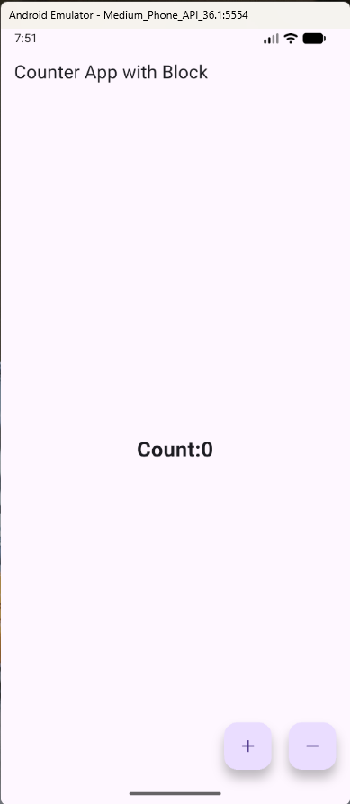

# Flutter Counter App (BLoC State Management)

Ei project ekta simple **Counter Application**, jekhane counter value **0 theke start** kore.  
App a **2 ta button** ache:

- ➕ Button — press korle **1 kore add**
- ➖ Button — press korle **1 kore minus**

Ei project ta ami **BLoC state management** shikhte & practice korar jonno baniyechi.

---

## ✨ Features

- Counter starts from **0**
- Press `+` to increase counter value
- Press `-` to decrease counter value
- Built with **Flutter BLoC**
- Beginner-friendly UI

---

## 🧠 State Management

Ei app a **BLoC/Cubit** use kora hoyeche state manage korar jonno.  
Counter er value state er maddhome update hoy.

---

## 📸 Screenshot

> App UI Screenshot👇



---

## 🚀 How to Run

```bash
git clone <your-repo-link>
cd <project-folder>
flutter pub get
flutter run
